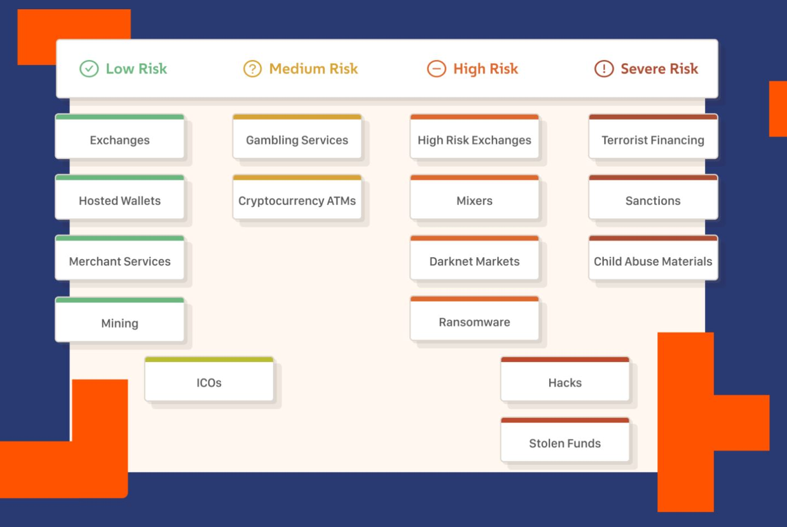
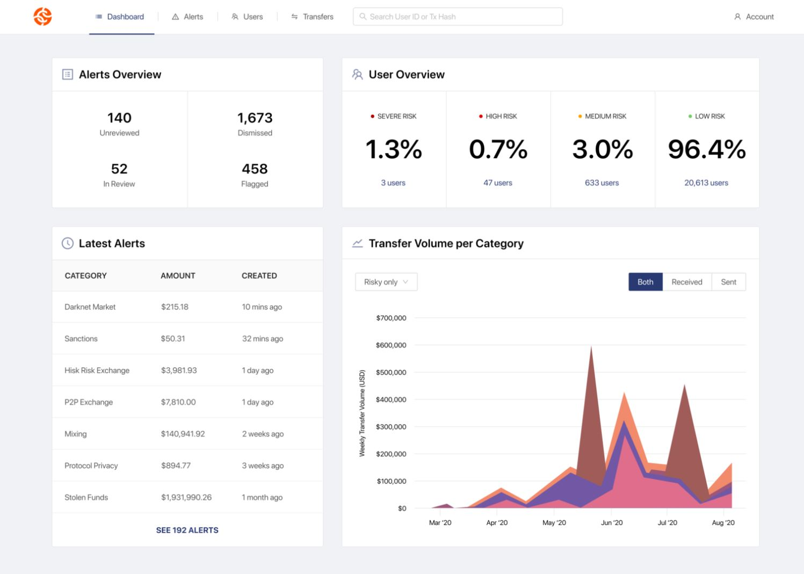

# REGTECH | CHAINALYSIS CASE STUDY

## Overview and Origin

* Name of company: 

    Chainalysis *(www.chainalysis.com)*

* When was the company incorporated? 

    Founded in 2014

* Who are the founders of the company?
    
    Michael Gronager, Co-founder, CEO; Jonathan Levin, Co-founder, COO; Jan Moller, Co-founder, CTO

* How did the idea for the company (or project) come about?

    Chainalysis was founded in 2014 as the official investigators into the hack of Mt. Gox, then the world’s largest cryptocurrency exchange.
    
    Co-Founder and Chief Executive Officer, Michael Gronager, was inspired to start Chainalysis when he saw how the cryptocurrency space was struggling to become part of the financial system. He used his experience from managing big data projects for scientists and his crypto knowledge from the industry’s early days to develop the data platform that has become the foundation of Chainalysis products today. Prior to Chainalysis, Michael was COO and co-founder of the cryptocurrency exchange Kraken.

* How is the company funded? How much funding have they received?
   
    They have been through 8 VC funding rounds worth a total $267M. 
    27 March 2021 they closed their most recent funding round at $100M.
    The company is now valued at $2B (USD) with 233 employees and growing.

## Business Activities

* What specific financial problem is the company or project trying to solve?

    ***Building trust in blockchains.***
    Chainalysis mission is to create transparency for a global economy built on blockchains, enabling banks, business, and governments to have a common understanding of how people use cryptocurrency.

* Who is the company's intended customer?  Is there any information about the market size of this set of customers?
What solution does this company offer that their competitors do not or cannot offer? (What is the unfair advantage they utilize?)

    The intended customer are all users of blockchain including financial services, businesses and governments to have a clearer view and trust of transactions going through the blockchain in order to create a more stable blockchain economy and reduce risks associated with blockchain and crytoassets.
    
    As the number of crytoassets in the market and transactions grows, the market size and opportunity grows. If banks, governements and large enterprise businesses for example were to increase their use of blockchain there would be more interest in ensuring risks are reduced and there was adequate trust and transparency in the system.

    Having expertise from earlier in the blockchain timeline (2014) and involvement in high profile cases such as Mt Gox gives strong credability to Chainalysis. The team has been refining their tools and processes on blockchain analysis for a number of years now which gives a strong competitive advantage.

    *Data/ Risk Matrix Identifying Target Areas:*
    

* Which technologies are they currently using, and how are they implementing them?

    Chainalysis do not openly disclose their tech stack or business processes to monitor, investigate and report on blockchain transactions. However, they have developed their own software platforms and part of their professional services and training which is available for their customers and those interested.

    ### Platforms implemented include:
    
    **Chainalysis KYT** - 'Know Your Transaction' combines industry-leading blockchain intelligence, an easy-to-use interface, and a real-time API to reduce manual workflows while helping cryptocurrency businesses comply with local and global regulations.
    
    **Chainalysis Reactor** - Explore. Investigate. Take Action. Reactor is the investigation software that connects cryptocurrency transactions to real-world entities, enabling you to combat criminal activity on the blockchain.
    
    **Chainalysis Kryptos** - Vet new opportunities and navigate risks in cryptocurrency. See complete profiles of cryptocurrency businesses based on the industry's most trusted blockchain data.

    Chainalysis Examples:

    *KYT Platform:*
    

    *Reactor Platform:*
    

    *Kryptos Platform:*
    

## Landscape

* What domain of the financial industry is the company in?

    Regulatory Technology (RegTech)

* What have been the major trends and innovations of this domain over the last 5-10 years?

    Increased regulatory demands -
    Since the economic crisis the huge increase in regulation throughout the financial services industry has lead to a drive for operational efficiency and better cost management. Regulators are demanding more advanced governance and data management, as well as enhanced reporting and operational processes.

    RegTech Partnerships - 
    Established fund managers and banks are becoming open to partnering with new and growing RegTech startups, in order to address their key operational and compliance challenges. Areas of financial services which are more easily adopting FinTech and RegTech solutions including payments, operations and governance. RegTech solutions can provide greater confidence in meeting an organisations broad governance requirements for risk and compliance.
    
    Lower RegTech barriers to entry - 
    Most RegTech technology is SaaS/Cloud based meaning startups can offer scalable, cost-efficient, secure compliance solutions. This means that the barrier to entry for RegTech companies is lower now than at any time in the past. Customised software tools can easily track the large multiple of regulatory obligations that face most financial services and asset management companies.
    
    Regulator Engagement - 
    Most of the world’s global financial regulators are playing catch-up to the emergence of new regulatory technologies. A number of key regulators are making RegTech a central focus of their innovation strategy.
    An examople is the new FCA regulatory “Sandbox” in the UK will allow eligible firms to test new solutions. These companies do not have to satisfy all regulatory requirements immediately but can test their solutions over a number of months gaining valuable experience and feedback.
    Regulators in the UK and Australia have agreed to refer innovative RegTech businesses to each other, as well as sharing information on emerging market trends and their impact on regulation.
    The growth in future RegTech opportunities will likely accelerate as dominant market players begin to adopt innovative regulatory and compliance solutions.

    Cost of compliance (and non-compliance) -
    This is well-documented in the financial sector: firms reportedly spend about 4% of their revenue complying with regulations, and banks for instance, paid $320bn in fines from 2007 to 2016.
    
    Pace of regulatory change and fragmentation -
    In the case of the financial services sector has accelerated in the aftermath of the Global Financial Crisis (GFC). Thomson Reuters, for example, recorded 56,300 regulatory updates globally in 2017, up from just 8,700 in 2008 and 17,800 in 2012.
    
    This combination of pressures on both industry and regulators drives a strong demand for technology-enabled compliance and oversight solutions.

* What are the other major companies in this domain?
    1. Elliptic
    2. Ascent Regtech
    3. Forter
    4. Hummingbird
    5. Continuity
    6. Trunomi
    7. Ayasdi
    8. IdentiyMind
    9. Sift Science
    10. ComplyAdvantage
    11. BehavioSec

## Results

* What has been the business impact of this company so far?

    Chainalysis was the main transaction investigation arm of the Mt Gox BTC theft and in 2017 claims to have traced up to $1.7B of the 'lost' BTC.

    60+ countries with Chainalysis users, spanning government agencies and private sector businesses.

    Over 100 digital assets supported across 10 native blockchains, encompassing 90% of cryptocurrency economic activity.

    375 organizations and counting rely on Chainalysis to make cryptocurrency safer for everyone.

    Chainalysis has helped many companies minimise their regulatory risk, investigate fraud/ transactions and build trust blockchain.

* What are some of the core metrics that companies in this domain use to measure success? How is your company performing, based on these metrics?

    Looking at the market capitalisation which has now grown to over $2B (USD), 233 staff and a large number of open roles Chainalysis is doing very well. 

    Core metrics may include areas such as transaction tracing success rate, 'lost' crytocurrency recovery rate, number of clients or number of investigations to name a few potential areas.

* How is this company performing relative to competitors in the same domain?

    Chainalysis is one of the first in blockchain transaction monitoring and looks to be by far the largest in the Blockchain RegTech space. A number of the competitors are more traditionally focussed on AML and Regulatory Compliance vs Blockchain specific detailed transaction analysis services.

## Recommendations

* If you were to advise the company, what products or services would you suggest they offer?

    AML Transaction Monitoring - with the experience in transaction analysis and investigations a natural opportunity would be to move into the AML space including KYC, Transaction Monitoring and Watchlist Screening.

* Why do you think that offering this product or service would benefit the company?

    Chainalysis has the experience and there is increasing regulatory pressure (and fines, note the Royal Commission and Westpac/ NAB) on companies to ensure adequate risk/ compliances systems are in place.

* What technologies would this additional product or service utilize?

    The industry has experienced an increase in regulations and reporting requirements, which has resulted in the entrance of various technologies and solutions in the market. 

    • Report automation platforms
    • Visual analytics
    • Robotic process automation
    • Next-generation data architecture
    • Business process management
    
    This could be a partnership with an existing Crypto AML company or building and additional platform using current tech stacks i.e. AWS/ Azure or ideally utilising the blockchain protocol itself.

* Why are these technologies appropriate for your solution?

    AWS/ Azure are 'best of breed' and have a lot of open source integration opportunities. Blockchain although a much newer technology has the potential to ensure a robust tracable ledger of information.

## Addendum / References
1. https://crypto.marketswiki.com/index.php?title=Chainalysis
2. https://www.chainalysis.com/
3. https://techcrunch.com/2021/03/26/chainalysis-raises-100m-doubles-valuation-to-over-2b/
4. https://www.chainalysis.com/chainalysis-reactor/
5. https://www.crunchbase.com/organization/chainalysis/company_financials
6. https://www.cnbc.com/2021/03/26/chainalysis-doubles-valuation-to-2-billion-with-benioff-backing.html
7. https://builtin.com/fintech/regtech-companies
8. https://go.chainalysis.com/rs/503-FAP-074/images/Chainalysis-Crypto-Crime-2021.pdf
9. https://blog.chainalysis.com/
10. https://regtech.org.au/resources/Documents/2019-ccaf-global-regtech-benchmarking-report.pdf
11. https://news.bitcoin.com/chainalysis-says-theyve-found-the-missing-1-7-billion-dollar-mt-gox-bitcoins/
12. https://geckogovernance.medium.com/regtech-5-key-drivers-of-global-innovation-7cd366e36a26
13. https://www.weforum.org/organizations/chainalysis
14. https://www.planetcompliance.com/the-application-of-blockchain-technology-in-the-regtech-sector/

